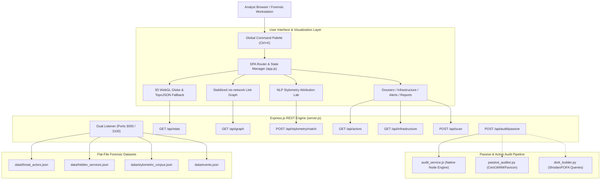

<div align="center">


# Anduril — DeProxy Threat Intelligence Platform
### *Enterprise Dark Web De-Anonymization, Onion Forensics & Multi-Vector Attribution*
#### **Smart India Hackathon (SIH) • Problem Statement ID: 26151**

[](tests/)
[](vercel.json)
[](package.json)
[](public/vendor/)
[](public/css/style.css)
[](LICENSE)

<p align="center">
  <b>A mathematical, explainable cyber threat intelligence workbench engineered for federal investigators, forensic analysts, and defensive cyber command units.</b><br/>
  Featuring real-time WebGL globe telemetry, stabilized link-analysis graphs, passive cryptographic reconnaissance, and computational stylometry.
</p>

[About & Overview](#-about-anduril--executive-overview) •
[Core Differentiators](#-core-differentiators--forensic-innovations) •
[Tech Stack](#-technology-stack) •
[System Architecture](#-system-architecture) •
[Mathematical Attribution](#-mathematical-attribution--fusion-framework) •
[Analytical Engines](#-analytical-engines-deep-dive) •
[Interactive Capabilities](#-interactive-capabilities) •
[API Reference](#-api-endpoints-reference) •
[Quick Start](#-quick-start) •
[Verification Matrix](#-automated-testing--verification-matrix) •
[Vercel Deployment](#-vercel-deployment) •
[Legal & Ethics](#-defense-in-depth--legal-disclaimers)

</div>

---

## 📑 Table of Contents
1. [🎯 About Anduril & Executive Overview](#-about-anduril--executive-overview)
   - [Mission Statement & Background](#1-mission-statement--background-sih-psid-26151)
   - [The Darknet Attribution Chasm](#2-the-darknet-attribution-chasm-the-problem-space)
   - [The Anduril Solution: Multi-Layered Corroboration](#3-the-anduril-solution-multi-layered-deterministic-corroboration)
   - [Comparative Capability Matrix](#4-comparative-capability-matrix)
   - [Target Deployment Scenarios](#5-target-deployment-scenarios)
2. [💡 Core Differentiators & Forensic Innovations](#-core-differentiators--forensic-innovations)
3. [🛠️ Technology Stack](#-technology-stack)
4. [🏗️ System Architecture](#-system-architecture)
   - [Data Flow Architecture](#data-flow-architecture)
   - [Clean Directory Structure](#directory-structure)
5. [📐 Mathematical Attribution & Fusion Framework](#-mathematical-attribution--fusion-framework)
   - [Normalized Weighting Constraint](#1-normalized-weighting-constraint)
   - [Channel-Specific Reliability Dampening](#2-channel-specific-reliability-dampening)
   - [Multi-Factor Source Reliability Engine](#3-multi-factor-source-reliability-engine)
   - [Composite Attribution Formulation](#4-composite-attribution-formulation)
   - [Global Contradiction Hard Gate](#5-global-contradiction-hard-gate)
   - [Confidence Band Calibration](#6-confidence-band-calibration)
6. [🔬 Analytical Engines Deep-Dive](#-analytical-engines-deep-dive)
   - [Track 1: Dark Web Site Operator Unmasking](#track-1-dark-web-site-operator-unmasking)
   - [Track 2: Targeted Persona & Threat Actor Unmasking](#track-2-targeted-persona--threat-actor-unmasking)
7. [🖥️ Interactive Capabilities & UI Workspace](#-interactive-capabilities)
8. [📡 API Endpoints Reference](#-api-endpoints-reference)
9. [⚡ Quick Start & Setup](#-quick-start)
10. [🧪 Automated Testing & Verification Matrix](#-automated-testing--verification-matrix)
11. [☁️ Vercel Deployment](#-vercel-deployment)
12. [⚖️ Defense-in-Depth & Legal Disclaimers](#-defense-in-depth--legal-disclaimers)
13. [👥 Team & Acknowledgments](#-team--acknowledgments)

---

## 🎯 About Anduril & Executive Overview

### 1. Mission Statement & Background (SIH PSID: 26151)
**Anduril** (formerly *DeProxy*) is an enterprise-grade cyber threat intelligence (CTI) and digital forensics platform specifically designed to tackle **Smart India Hackathon Problem Statement 26151**: *Targeted Dark Web Operator & User De-Anonymization*.

The platform provides national cybersecurity agencies, federal law enforcement, CERT/CSIRT units, and defensive security operations centers (SOCs) with an explainable, court-admissible investigative workbench to unmask:
1. **The physical infrastructure and operators** hosting and running illicit `.onion` v3 hidden services.
2. **The real-world personas and identities** of targeted threat actors, ransomware operators, data brokers, and cyber syndicates operating across underground forums.

---

### 2. The Darknet Attribution Chasm: The Problem Space
The Tor network's architecture purposefully decouples public network addresses from server hardware:
- **Tor v3 Cryptographic Camouflage**: Onion routing obscures IP addresses through multi-hop circuit rendezvous points, rendering traditional traceroutes, WHOIS lookups, and reverse DNS completely ineffective.
- **The Attribution Asymmetry**: Cyber adversaries operate with near-zero friction across underground forums (BreachForums, Dread, XSS, Exploit.in, Telegram), launching ransomware campaigns, auctioning critical infrastructure leaks, and laundering proceeds through cryptocurrency mixers.
- **The Flaws of Legacy CTI Tools**: Existing solutions either rely on:
  - *Naive keyword scraping* that breaks on minor forum markup changes, or
  - *Opaque neural network heuristics* that produce unsubstantiated "hunches" prone to hallucinations and devastating false-positive criminal attributions.

---

### 3. The Anduril Solution: Multi-Layered Deterministic Corroboration
Anduril abandons single-point heuristic guesses in favor of a **Four-Pillar Corroboration Architecture**:

```
                       ┌────────────────────────────────────────────────────────┐
                       │               THE 4 PILLARS OF ANDURIL                 │
                       └───────────────────────────────────┬────────────────────┘
                                                           │
        ┌──────────────────────────────────┬───────────────┴───────────────┬──────────────────────────────────┐
        ▼                                  ▼                               ▼                                  ▼
┌───────────────────────────────┐ ┌───────────────────────────────┐ ┌───────────────────────────────┐ ┌───────────────────────────────┐
│     PILLAR I: NETWORK &       │ │    PILLAR II: PERSONA &       │ │    PILLAR III: COMPUTATIONAL  │ │      PILLAR IV: TWO-TIER    │
│    INFRASTRUCTURE AUDIT       │ │       IDENTITY FUSION         │ │         NLP STYLOMETRY        │ │         FUSION GATING       │
├───────────────────────────────┤ ├───────────────────────────────┤ ├───────────────────────────────┤ ├───────────────────────────────┤
│ • SSL/TLS Cert SAN & Serial   │ │ • Cross-Forum Handle Linking  │ │ • Type-Token Ratio (TTR)      │ │ • Level 1: Reliability Damp.  │
│ • JARM Multi-Client TLS Probe │ │ • PGP Fingerprint Trust Web   │ │ • Shannon Punctuation Entropy │ │ • Level 2: Hard Gate Refusal  │
│ • Favicon MurmurHash3 (MMH3)  │ │ • BTC/XMR UTXO & KYC Tracing  │ │ • Syntax Markers (::, bro)    │ │ • Zero-Hallucination Guard    │
│ • Apache /server-status Leaks │ │ • Telegram / Jabber Footprint │ │ • Currency Postfix Formatting │ │ • Mathematical Reproducibility│
│ • Blind SSRF / SQLi OOB Egress│ │ • 24h Activity Cadence Wheel  │ │ • Ranked Linguistic Matching  │ │ • Court-Admissible Dossiers   │
└───────────────────────────────┘ └───────────────────────────────┘ └───────────────────────────────┘ └───────────────────────────────┘
```

---

### 4. Comparative Capability Matrix

| Forensic Capability | Conventional Darknet Crawlers | Commercial CTI Feeds | Anduril Platform |
| :--- | :---: | :---: | :---: |
| **Origin IP Discovery** | ❌ Not Supported (Tor Only) | ⚠️ Generic Shodan Queries | ✅ **Multi-Vector Passive & Active OOB Probing** |
| **JARM & Favicon Correlation** | ❌ None | ⚠️ Manual Lookups | ✅ **Automated Shodan & FOFA Dork Generation** |
| **Authorship Attribution** | ❌ None | ⚠️ Keyword Tagging | ✅ **Statistical NLP Stylometry & Dialect Signatures** |
| **False-Positive Prevention** | ❌ High Error Rate | ⚠️ Confidence Guesswork | ✅ **Deterministic Two-Tier Contradiction Hard Gates** |
| **Network Air-Gap Readiness** | ❌ Requires Cloud SaaS | ❌ Requires Cloud APIs | ✅ **100% Zero-External-CDN Self-Hosted Offline** |
| **Topology Link Analysis** | ❌ Static Tables | ⚠️ Basic Charts | ✅ **Stabilized Force Graph with Physics Freeze** |
| **3D Telemetry Visualization** | ❌ None | ⚠️ Static 2D Maps | ✅ **Real-Time WebGL Globe with TopoJSON Fallback** |
| **Evidence Dossier Generation** | ⚠️ Plain Screenshots | ⚠️ Standard PDF Summary | ✅ **Forensic Export in PDF, JSON, & Clean CSV** |

---

### 5. Target Deployment Scenarios

- 🏛️ **Federal Law Enforcement & Cyber Crime Cells**: Generate evidence-backed forensic case dossiers for judicial subpoenas, search warrants, and criminal indictments.
- 🛡️ **National Defense & CERT / CSIRT Units**: De-anonymize state-sponsored Advanced Persistent Threat (APT) syndicates and command-and-control (C2) darknet relays.
- 🏢 **Enterprise Threat Intelligence (CTI) & SOCs**: Correlate intercepted ransomware extortion communiqués and identify source leak portals before public disclosure.
- 🎓 **Forensic Researchers & Academic Labs**: Experiment with computational stylometry and passive dark web network topology in a secure, air-gapped sandbox.

---

## 💡 Core Differentiators & Forensic Innovations

```
┌──────────────────────────────────────────────────────────────────────────────────────────┐
│                               6 CORE FORENSIC INNOVATIONS                                │
├──────────────────────────────────────────────────────────────────────────────────────────┤
│ 1. Dual-Track Targeted De-Anonymization                                                  │
│    • Track 1: Unmasks the physical server IP, ISP, and host of a .onion site controller. │
│    • Track 2: Identifies the real-world human identity behind pseudonymous darknet users.│
│                                                                                          │
│ 2. Two-Tier Contradiction Fusion & Hard Gating                                           │
│    • Level 1: Reliability Dampening penalizes noisy or single-source intelligence.       │
│    • Level 2: Hard Gate overrides attribution to INCONCLUSIVE on conflicting PGP/temporal│
│               indicators, preventing catastrophic false-positive criminal attributions.  │
│                                                                                          │
│ 3. Computational Stylometric Profiling (NLP Authorship Attribution)                      │
│    • Mathematical lexical analysis: Type-Token Ratio (TTR), Shannon punctuation entropy, │
│      signature token delimiters (::), slang syntax (bro/fam), and currency habits.       │
│                                                                                          │
│ 4. 100% Air-Gapped Zero-CDN Architecture                                                 │
│    • All vector icons, fonts, 3D globe models, chart engines, and force graphs are       │
│      self-hosted locally. Complete execution in isolated, classified SCIF networks.      │
│                                                                                          │
│ 5. Stabilized Force-Directed Link Analysis (Jitter Elimination)                          │
│    • Dynamic topology graphs run temporary physics and auto-freeze upon settlement,      │
│      providing an ergonomic, Palantir-grade link analysis workbench with entity focus.   │
│                                                                                          │
│ 6. Dual-Mode Telemetry: 3D WebGL Globe with Resilient TopoJSON Fallback                  │
│    • Renders live orbital threat telemetry in WebGL; automatically switches to an offline│
│      Natural Earth vector projection if hardware acceleration is unavailable.            │
└──────────────────────────────────────────────────────────────────────────────────────────┘
```

---

## 🛠️ Technology Stack

| Layer | Technologies | Key Highlights |
| :--- | :--- | :--- |
| **Frontend Framework** | Vanilla HTML5 / ES6 Modules | Zero frontend bloat, instant hydration, strict CSP compliance |
| **Design System** | Tailwind CSS 3.4 + Slate & Teal (21st.dev) | High-density tactical UI, seamless dark/light mode persistence |
| **3D Telemetry** | `globe.gl` 2.46 + Three.js | Real-time WebGL origin radar dots, ballistic arcs, responsive canvas |
| **Vector Fallback** | `d3-geo`, `topojson-client`, `world-atlas` | Offline 110m Natural Earth TopoJSON geometry fallback |
| **Link Topology Graph** | `vis-network` 9.1 | Stabilized force-directed graph with auto-freezing physics engine |
| **Data Visualizations** | `chart.js` 4.4 | 24-hour activity distribution wheels, category doughnut radars |
| **Backend Core** | Express.js 5.2 / Node.js >=18 | Dual-port architecture (3000 & 3100), REST dispatcher |
| **Serverless Engine** | `@vercel/node` + `audit_service.js` | Zero-dependency native Node.js reconnaissance engine for Vercel |
| **Reconnaissance Engine** | Python 3.8+ (`shodan`, `fofa`) | TLS serial parser, Favicon MMH3 hash calculator, JARM scanner |
| **Automated Testing** | Playwright 1.51 | 21/21 E2E tests validating air-gap compliance, palette, & fallbacks |

---

## 🏗️ System Architecture

### Data Flow Architecture



### Directory Structure

```plaintext
DarkWeb--main/
├── backend/
│   └── modules/
│       └── passive_audit/
│           ├── audit_service.js       # Native Node.js dork & audit engine (Vercel-ready)
│           ├── config.json            # Shodan & FOFA API key configurations
│           ├── dork_builder.py        # Python search engine dork compiler
│           ├── fofa_client.py         # FOFA API query client
│           ├── passive_auditor.py     # Passive technical audit engine (certs, hashes, JARM)
│           └── shodan_client.py       # Shodan API query client
├── data/
│   ├── events.json                    # Historical timeline breach & operation logs
│   ├── hidden_services.json           # Indexed .onion services, JARM, SSL serials, origin IPs
│   ├── stylometric_corpus.json        # Threat actor baseline writing samples & signatures
│   └── threat_actors.json             # Profiles, wallets, PGP keys, aliases & real identities
├── public/
│   ├── assets/
│   │   ├── anduril-mark.svg           # Brand vector icon
│   │   ├── favicon.svg                # Browser tab icon
│   │   ├── land.json                  # TopoJSON offline geometry for WebGL & fallback
│   │   └── world-map.svg              # Offline Natural Earth vector fallback map
│   ├── css/
│   │   ├── style.css                  # Tailored design system (light/dark mode variables)
│   │   └── tailwind.css               # Compiled utility stylesheet
│   ├── js/
│   │   ├── app.js                     # SPA router, state manager, palette & theme engine
│   │   └── views/                     # 12 Modular view controllers
│   │       ├── alerts.js              # Real-time IOC notifications & breach feeds
│   │       ├── dashboard.js           # 3D WebGL Globe & metrics overview
│   │       ├── discover.js            # Faceted search and discovery
│   │       ├── graph.js               # Stabilized vis-network topology graph
│   │       ├── infrastructure.js      # Onion audit scanner & origin unmasking
│   │       ├── investigations.js      # Active case management & evidence chain
│   │       ├── personas.js            # Threat actor dossiers, PGP, & wallets
│   │       ├── reports.js             # Forensic PDF/JSON/CSV case export
│   │       ├── services.js            # Monitored onion hidden services table
│   │       ├── sources.js             # Ingestion pipelines & crawler status
│   │       ├── stylometry.js          # NLP authorship analysis workbench
│   │       └── watchlist.js           # Target entity monitoring list
│   └── vendor/                        # 100% Air-Gapped Local Vendor Bundles
│       ├── chart.umd.js               # Chart.js v4.4.8
│       ├── globe.gl.min.js            # Three.js 3D globe visualization
│       ├── vis-network.min.js         # Force-directed link analysis engine
│       └── fontawesome/               # FontAwesome 6.4.0 vector icons
├── scripts/
│   ├── build-assets.js                # Offline asset builder & TopoJSON extraction tool
│   └── tailwind.css                   # Tailwind source directives
├── tests/
│   ├── actions.spec.js                # Action verification suite (navigation, exports, forms)
│   └── ui.spec.js                     # UI resilience suite (WebGL failover, themes, air-gap)
├── implementation_plan.md             # SIH 26151 technical methodology specification
├── package.json                       # Dependencies, lifecycle scripts & metadata
├── playwright.config.js               # Playwright test harness configuration
├── server.js                          # Express.js REST API & static server
├── start_dashboard.bat                # Windows quick launcher
├── tailwind.config.js                 # Tailwind CSS theme configuration
└── vercel.json                        # Vercel serverless deployment specification
```

---

## 📐 Mathematical Attribution & Fusion Framework

To prevent subjective investigator bias and AI hallucinations, Anduril implements a **Two-Tier Contradiction Fusion Model**.

### 1. Normalized Weighting Constraint
The platform evaluates four independent investigative channels $\mathcal{C} = \{\text{Infra}, \text{Crypto}, \text{Stylometry}, \text{PGP}\}$ with strictly normalized weights:
$$\sum_{i \in \mathcal{C}} w_i = 1.0 \quad \text{where} \quad w_{\text{Infra}} = 0.35, \; w_{\text{PGP}} = 0.30, \; w_{\text{Crypto}} = 0.20, \; w_{\text{Stylometry}} = 0.15$$

### 2. Channel-Specific Reliability Dampening
Raw technical similarity scores $s_i \in [0, 100]$ are dampened by their channel reliability coefficient $R_i \in [0.1, 1.0]$:
$$s_i^* = s_i \times R_i$$

### 3. Multi-Factor Source Reliability Engine
Each intelligence source's reliability coefficient $R_i$ is dynamically computed from four objective criteria:
$$R_i = 0.40 \cdot \text{Reputation} + 0.30 \cdot \text{Freshness} + 0.20 \cdot \text{Corroboration} + 0.10 \cdot \text{Consistency}$$

### 4. Composite Attribution Formulation
The base fused attribution confidence $S_{\text{composite}}$ is the weighted sum of dampened channel scores:
$$S_{\text{composite}} = \sum_{i \in \mathcal{C}} \left( w_i \times s_i \times R_i \right)$$

### 5. Global Contradiction Hard Gate
Before assigning an attribution confidence state, the engine evaluates contradictory hard gates $\mathcal{G}_{\text{conflict}}$:
$$\text{If } \mathcal{G}_{\text{conflict}} = \text{TRUE} \implies S_{\text{final}} = \text{INCONCLUSIVE} \; (0.0\%)$$
- **Cryptographic Gate**: The target produces a cryptographically valid PGP signature belonging to an entirely distinct identity.
- **Physical Gate**: Network telemetry demonstrates impossible physical concurrent residency across geographic origins during identical operational timestamps.

### 6. Confidence Band Calibration

| Band | Confidence Range | Forensic Meaning | Actionable Recommendation |
| :--- | :---: | :--- | :--- |
| 🟢 **HIGH** | `90.0% – 100.0%` | Definitive technical & persona link | Court-admissible dossier, law enforcement escalation |
| 🟡 **PROBABLE** | `75.0% – 89.9%` | Strong multi-channel overlap | Target for active surveillance & financial subpoena |
| 🟠 **SUSPECT** | `50.0% – 74.9%` | Correlated weak indicators | Keep on automated watchlist; gather further corpus |
| 🔴 **INCONCLUSIVE** | `< 50.0%` or Gated | Contradicted or insufficient | Insufficient evidence; hard gate refusal active |

---

## 🔬 Analytical Engines Deep-Dive

### Track 1: Dark Web Site Operator Unmasking
*Goal: Identify the physical IPv4, hosting provider, and geographic origin of `.onion` controllers.*

1. **TLS / SSL Certificate Cross-Matching**:
   - Extracts SSL serial numbers and Subject Alternative Names (SANs) from target hidden services.
   - Correlates hashes against clearnet Shodan/Censys indices to discover clearnet vhosts sharing the identical certificate.
2. **JARM TLS Fingerprinting**:
   - Sends 10 crafted TLS Client Hello packets to capture server-specific cipher and extension negotiation sequences.
   - Discovers co-located infrastructure running the exact same reverse-proxy build.
3. **Favicon MurmurHash3 (MMH3)**:
   - Fetches the site favicon, computes its 32-bit MurmurHash, and generates automated Shodan dorks (`http.favicon.hash:<hash>`).
4. **Apache `/server-status` & ETag Inode Leaks**:
   - Detects exposed scoreboard diagnostic pages leaking real client connection IP tables and internal server names.
   - Parses HTTP ETag headers to extract raw Unix inode numbers, system timestamps, and filesystem footprints.
5. **Active Out-of-Band (OOB) Probing**:
   - Probes web applications for Blind Server-Side Request Forgery (SSRF) and Out-of-Band SQL Injection (DNS resolution), forcing the backend server to resolve an external listener directly over clearnet, bypassing the Tor loopback entirely.

---

### Track 2: Targeted Persona & Threat Actor Unmasking
*Goal: Tie darknet pseudonyms, PGP signatures, and cryptocurrency addresses to real-world entities.*

1. **Multi-Platform Handle Fusion**:
   - Aggregates activity records across BreachForums, Dread, XSS, Exploit.in, and Telegram into a singular investigative node.
2. **PGP Key Fingerprint & Trust Web**:
   - Validates OpenPGP key fingerprints (`40-hex`) and cross-checks historical keyserver submissions for leaked email handles.
3. **Cryptocurrency UTXO & Exchange Tracing**:
   - Indexes Bitcoin (BTC) and Monero (XMR) transaction inputs/outputs.
   - Flags transactions intersecting with KYC-compliant clearnet exchanges and custodial payment gateways.
4. **Computational Stylometry (NLP Forensic Attribution)**:
   - Calculates **Type-Token Ratio (TTR)** for vocabulary richness: $\text{TTR} = \frac{|V|}{N}$
   - Computes **Sentence Length Variance** and punctuation entropy.
   - Detects habitual dialect markers:
     - `::` signature double-colon delimiters (e.g., IntelBroker syntax habits).
     - Colloquial dialect and slang (`bro`, `fam`).
     - Regional punctuation (French `« »` guillemet quotes, postfixed currency `1000$`).
5. **24-Hour Timezone Cadence Wheel**:
   - Plots timestamp distributions across 24 hours to deduce the actor's primary operating timezone and sleep cycle.

---

## 🖥️ Interactive Capabilities

<details open>
<summary><b>1. Global Command Palette (<code>Ctrl + K</code> / <code>Cmd + K</code>)</b></summary>
<br>

- **Universal Search**: Instantly queries all threat actors, `.onion` services, origin IPs, and CVEs.
- **Deep Linking**: Press `Enter` or click any result to route immediately to its corresponding investigative dossier.
- **Accessibility**: Full focus-trapping, keyboard arrow selection, and Escape dismissal.

</details>

<details>
<summary><b>2. 3D WebGL Threat Globe & Offline Fallback</b></summary>
<br>

- **Real-time Telemetry**: Interactive Three.js globe displaying ballistic flight paths from ingress nodes (Washington DC, Paris, Moscow) to unmasked origin nodes (Bucharest).
- **Graceful Fallback**: Automatically switches to an offline vector projection using Natural Earth TopoJSON geometry if WebGL is disabled or hardware acceleration fails.
- **Reduced Motion Support**: Halts automatic rotation and radar ping effects when `prefers-reduced-motion` is detected.

</details>

<details>
<summary><b>3. Stabilized Forensic Topology Graph</b></summary>
<br>

- **Physics Stabilization**: Runs initial force-directed physics and auto-freezes once nodes settle, preventing annoying visual bounce.
- **Faceted Entity Filters**: Dynamically toggle `Threat Actors`, `Hidden Services`, `Origin IPs`, `Wallets`, and `Breach Leaks`.
- **Forensic Inspector**: Clicking any node opens a slide-over dossier with confidence ratings and connected evidence items.

</details>

<details>
<summary><b>4. Publication-Grade Forensic Case Reports</b></summary>
<br>

- **Selective Entity Export**: Choose specific threat actors or export full system briefs.
- **Client-Side PDF Generation**: Produces print-ready forensic dossiers with full evidence audit trails.
- **Standardized Formats**: Instant download in structured CSV, JSON, and PDF formats.

</details>

---

## 📡 API Endpoints Reference

Base URL: `http://localhost:3000` *(Secondary listener: `http://localhost:3100`)*

| Method | Endpoint | Description | Sample Query / Body |
| :---: | :--- | :--- | :--- |
| `GET` | `/api/stats` | Aggregated telemetry, scanner counters, unmasked origin IPs | `None` |
| `GET` | `/api/actors` | Forensic catalog of indexed threat actors with multi-facet filters | `?query=intel&threat_level=CRITICAL` |
| `GET` | `/api/actors/:id` | Deep dossier for a specific actor, including linked infrastructure | `/api/actors/TA-001` |
| `GET` | `/api/infrastructure` | Indexed `.onion` services, JARM hashes, origin IP attributions | `None` |
| `GET` | `/api/timeline` | Temporal event logs with date range and actor filtering | `?actor_id=TA-001&from=2024-01-01` |
| `GET` | `/api/graph` | Force-directed nodes and edges formatted for `vis-network` | `None` |
| `POST` | `/api/stylometry/match` | Computational NLP stylometric scoring against suspect text | `{"text": "Sample darkweb post content..."}` |
| `POST` | `/api/scan` | Passive infrastructure audit (Certs, JARM, Server-Status) | `{"onion_address": "intelbrk...onion"}` |
| `POST` | `/api/scan/active` | Active web vulnerability probe (Blind SSRF & SQLi OOB) | `{"onion_address": "intelbrk...onion"}` |
| `POST` | `/api/audit/passive` | Run passive Python auditor script with fallback to Node | `{"onion_address": "target.onion"}` |
| `GET` | `/api/audit/dorks` | Generate passive Shodan and FOFA search dork strings | `?domain=api.privatelayer-ro.net` |

---

## ⚡ Quick Start

### Prerequisites
- **Node.js**: `v18.0.0` or higher
- **npm**: `v9.0.0` or higher
- *(Optional)* **Python 3.8+** with `shodan` / `fofa` modules for active probe scripts

### 1. Clone & Install Dependencies

```bash
git clone https://github.com/Swayamyadav01/SIH26151--Anduril.git
cd SIH26151--Anduril

# Install dependencies using frozen lockfile
npm ci --no-audit
```

### 2. Build Offline Production Assets

```bash
npm run build
```
*Compiles the Tailwind CSS design system and extracts offline vendor assets (`land.json`, `world-map.svg`, and JavaScript libraries).*

### 3. Start the Server

```bash
npm start
```
- Access the dashboard: 👉 [**http://localhost:3000**](http://localhost:3000) *(or [http://localhost:3100](http://localhost:3100))*
- Custom port: `PORT=8080 npm start`

---

## 🧪 Automated Testing & Verification Matrix

The codebase contains a comprehensive **Playwright** end-to-end verification suite across 21 test scenarios:

```bash
npm test
```

### Verified Test Matrix (21/21 Passed • 100% Green)

| ID | Test Scenario | Verification Scope | Status |
| :---: | :--- | :--- | :---: |
| `01` | **Identity & Design System** | Validates brand mark, theme persistence, and clean navigation | `✓ PASSED` |
| `02` | **Persona Dossier & Identifiers** | Verifies evidence export, linked service navigation, and filters | `✓ PASSED` |
| `03` | **Discover Module** | Opens exact actor and service dossiers from matching search queries | `✓ PASSED` |
| `04` | **Reports Export** | Validates CSV export and client-side print execution | `✓ PASSED` |
| `05` | **Custom Dossier Selection** | Verifies targeted actor selection and custom PDF/CSV generation | `✓ PASSED` |
| `06` | **Alerts Lifecycle** | Acknowledges, dismisses, and retains alert state changes | `✓ PASSED` |
| `07` | **Watchlist Management** | Tests addition, removal, and persistent tracking of target entities | `✓ PASSED` |
| `08` | **Scanner Interaction** | Tests passive & active scanner trigger buttons and mock responses | `✓ PASSED` |
| `09` | **Investigation Workspace** | Validates case file details, evidence chains, and dossier actions | `✓ PASSED` |
| `10` | **Dashboard Theme Cycle** | Repeated dark/light mode toggles with zero runtime errors | `✓ PASSED` |
| `11` | **Command Palette Routing** | Tests `Ctrl+K` search routing directly to actor, IP, and onion dossiers | `✓ PASSED` |
| `12` | **Palette Keyboard Trap** | Verifies arrow navigation, focus trap, and Escape dismissal | `✓ PASSED` |
| `13` | **3D Globe Lifecycle** | Validates WebGL rotation, zoom, resizing, and canvas disposal | `✓ PASSED` |
| `14` | **Resilient Vector Fallback** | Validates offline SVG map fallback when WebGL library is absent | `✓ PASSED` |
| `15` | **Graph Physics Stabilization** | Tests link graph auto-freezing, type filtering, and node inspector | `✓ PASSED` |
| `16` | **Stylometric Matching** | Handles empty inputs, NLP markers, and API failure boundaries | `✓ PASSED` |
| `17` | **Viewport Containment** | Verifies all 12 views render within bounds across desktop and mobile | `✓ PASSED` |
| `18` | **Fault-Tolerant Retry** | Validates network error boundaries and operational retry buttons | `✓ PASSED` |
| `19` | **Accessibility & Reduced Motion** | Halts globe rotation and pulse effects on `prefers-reduced-motion` | `✓ PASSED` |
| `20` | **Table Overflow Containment** | Confines 56-character `.onion` strings and wallet hashes in bounds | `✓ PASSED` |
| `21` | **Hardware Acceleration Failover** | Graceful failover to 2D vector map upon WebGL context loss | `✓ PASSED` |

---

## ☁️ Vercel Deployment

Anduril is pre-configured for automated serverless deployment on [Vercel](https://vercel.com):

1. **Serverless Entrypoint:** [server.js](server.js) exports the Express application instance (`module.exports = app`).
2. **Serverless Routing:** [vercel.json](vercel.json) routes all incoming requests to the serverless function runtime.
3. **Deployment Optimization:** [.vercelignore](.vercelignore) strips test artifacts and dev scripts from the serverless bundle.
4. **Native Node.js Fallback:** [backend/modules/passive_audit/audit_service.js](backend/modules/passive_audit/audit_service.js) provides pure JavaScript execution of Shodan/FOFA dork generation when Python is not available in serverless runtimes.

Deploy directly via Git:
```bash
git push origin main
```

---

## ⚖️ Defense-in-Depth & Legal Disclaimers

> [!IMPORTANT]
> **Authorized Threat Intelligence & Defensive Research Use Only**  
> Anduril is developed strictly for authorized cybersecurity researchers, law enforcement personnel, and computer incident response teams (CERT/CSIRT). Stylometric attribution scores represent probabilistic statistical confidence intervals and must be corroborated with verifiable cryptographic keys, network IOCs, or legal subpoenas before drawing definitive conclusions in judicial proceedings.

---

## 👥 Team & Acknowledgments

- **Lead Developer**: [Swayam Yadav](https://github.com/Swayamyadav01)
- **Collaborator**: [Abdul Chaudhari](https://github.com/abdulchaudhari)
- **Initiative**: Smart India Hackathon (SIH) • Problem Statement ID: 26151
- **Repository**: [https://github.com/Swayamyadav01/SIH26151--Anduril](https://github.com/Swayamyadav01/SIH26151--Anduril)

<div align="center">

Made with 🛡️ for Cyber Defense & Threat Intelligence

</div>
